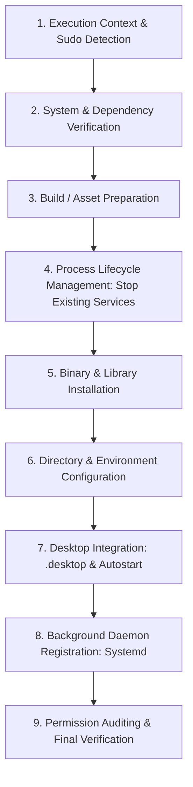

# Engineering Reference Guide: Designing & Operating Linux Desktop Installer Scripts

This reference document outlines architectural principles, standards, filesystem conventions, security guidelines, desktop integration patterns, and lifecycle management for developing robust **Linux Installer Scripts** for desktop applications.

---

## 1. Overview & Purpose

Unlike macOS (`.dmg`) or Windows (`.exe` / `.msi`), Linux distributions traditionally rely on package managers (`apt`, `dnf`, `pacman`) or containerized formats (`AppImage`, `Flatpak`, `Snap`). However, for independent software vendors (ISVs), internal corporate tools, open-source projects, and self-hosted agents, **Automated Shell Installer Scripts (`install.sh`)** serve as an essential deployment mechanism.

### Key Goals of a Linux Installer Script
- **Zero-Friction Deployment**: Automate binary installation, dependency checks, directory creation, permissions, and desktop integration in a single command.
- **Desktop Environment Integration**: Ensure the application appears seamlessly in system menus, docks, application launchers, and autostart routines across desktop environments (GNOME, KDE Plasma, XFCE, Cinnamon, MATE).
- **Environment & Lifecycle Management**: Provision background daemons (`systemd`), default configuration files, data persistence directories, and clean uninstallation paths (`uninstall.sh`).
- **Flexible Security Boundary**: Support both non-root user-space installations (`~/.local`) and system-wide administrative installations (`/usr/local`).

---

## 2. Linux Filesystem Standards & Installation Modes

Linux installers must strictly adhere to the **Filesystem Hierarchy Standard (FHS)** and the **XDG Base Directory Specification**.

### 2.1 User-Space vs. System-Wide Layouts

| Component | User-Space Installation (No `sudo`) | System-Wide Installation (`sudo`) |
| :--- | :--- | :--- |
| **Application Binaries** | `~/.local/bin/` | `/usr/local/bin/` or `/opt/AppName/` |
| **Desktop Launchers** | `~/.local/share/applications/` | `/usr/share/applications/` |
| **Application Icons** | `~/.local/share/icons/hicolor/...` | `/usr/share/icons/hicolor/...` |
| **Configuration Files** | `~/.config/AppName/` | `/etc/AppName/` or `~/.config/AppName/` |
| **Data & Storage** | `~/.local/share/AppName/` | `~/.local/share/AppName/` or `/var/lib/AppName/` |
| **Background Services** | `~/.config/systemd/user/` | `/etc/systemd/system/` or `~/.config/systemd/user/` |
| **Autostart Shortcuts** | `~/.config/autostart/` | `/etc/xdg/autostart/` |

---

## 3. End-to-End Installation Workflow

A standard Linux installer script should follow a structured 9-stage execution workflow:



### Stage Breakdown

1. **Context & Privilege Detection**:
   - Detect whether the script is running directly as `$USER` or via `sudo`.
   - Identify target `$REAL_USER`, home directory `$REAL_HOME`, and target group `$REAL_GROUP`.
2. **Dependency Verification**:
   - Check required system tools (`go`, `node`, `npm`, `curl`, `systemctl`, `update-desktop-database`).
   - Abort early with actionable instructions if critical toolchains are missing.
3. **Compilation & Assembly**:
   - Build static frontend assets (e.g., React/Vue SPA) and compile Go/C/Rust application binaries.
4. **Active Process Management**:
   - Stop running instances of the application or background daemon before replacing binaries to prevent Linux **"Text file busy" (`ETXTBSY`)** errors.
5. **Binary & Asset Installation**:
   - Copy or compile binaries into target directory (`/usr/local/bin` or `~/.local/bin`).
   - Set strict execution permissions (`chmod 755`).
6. **Configuration & Data Provisioning**:
   - Generate default configuration files (`config.json`, `.env`) without overwriting existing user settings.
   - Enforce proper ownership (`chown -R $REAL_USER:$REAL_GROUP`) when executing under `sudo`.
7. **XDG Desktop Integration**:
   - Write `.desktop` launcher shortcuts and update the desktop MIME/application database.
8. **Daemon Registration**:
   - Deploy `systemd` user service files and trigger `systemctl --user daemon-reload` and `enable --now`.
9. **Permission Auditing & User Feedback**:
   - Audit hardware device groups (e.g., `input` group for hardware trackers or `video`/`render` for GPU acceleration).
   - Output management commands and launch instructions.

---

## 4. XDG Desktop Integration & GUI Launcher Architecture

### 4.1 FreeDesktop `.desktop` File Specification

Desktop environments identify and present applications in application menus, docks, and search bars using `.desktop` files formatted according to the **FreeDesktop Desktop Entry Specification**.

#### Standard `.desktop` Template (`mini-tracker.desktop`)
```ini
[Desktop Entry]
Type=Application
Version=1.0
Name=Mini Tracker
GenericName=Productivity Tracker Desktop App
Comment=Privacy-first Linux Productivity Tracker & AI Analyzer
Exec=/home/user/.local/bin/mini-tracker-gui
Icon=utilities-system-monitor
Terminal=false
Categories=Utility;Development;Office;
Keywords=productivity;tracker;time;analytics;
StartupNotify=true
StartupWMClass=mini-tracker
```

### 4.2 Web App to Standalone Desktop App Window Conversion

When deploying web-based desktop applications (Go + React/Vue embedded servers), pointing `.desktop` files directly to `xdg-open http://localhost:8080` opens a new tab in the user's primary web browser.

To present the application as a **native standalone desktop window**, the installer provides a dedicated launcher wrapper script (`mini-tracker-gui`) that uses Chromium/Chrome `--app=` mode:

```bash
#!/usr/bin/env bash
# Mini Tracker Standalone GUI Launcher

# 1. Load environment configuration
ENV_FILE="$HOME/.config/mini-tracker/.env"
if [ -f "$ENV_FILE" ]; then
    set -a; source "$ENV_FILE"; set +a
fi

ENDPOINT="${BACKEND_ENDPOINT:-http://localhost:8080}"

# 2. Ensure background server is running
if ! pgrep -f "mini-tracker-server" >/dev/null 2>&1; then
    mini-tracker-server &
    sleep 1
fi

# 3. Launch dedicated window in app mode
if command -v google-chrome >/dev/null 2>&1; then
    exec google-chrome --app="${ENDPOINT}" --class="mini-tracker" --name="Mini Tracker" "$@"
elif command -v chromium >/dev/null 2>&1; then
    exec chromium --app="${ENDPOINT}" --class="mini-tracker" --name="Mini Tracker" "$@"
elif command -v brave-browser >/dev/null 2>&1; then
    exec brave-browser --app="${ENDPOINT}" --class="mini-tracker" --name="Mini Tracker" "$@"
elif command -v microsoft-edge >/dev/null 2>&1; then
    exec microsoft-edge --app="${ENDPOINT}" --class="mini-tracker" --name="Mini Tracker" "$@"
else
    exec xdg-open "${ENDPOINT}"
fi
```

---

## 5. Background Daemons with Systemd User Services

For desktop applications that include background agents, periodic synchronization routines, or data trackers, installers should register a **Systemd User Service**.

### `mini-tracker.service` Template
```ini
[Unit]
Description=Mini Tracker Productivity Daemon
After=network.target

[Service]
Type=simple
ExecStart=%h/.local/bin/mini-tracker-server
Restart=always
RestartSec=5s
Environment="PORT=8080"
EnvironmentFile=-%h/.config/mini-tracker/.env

[Install]
WantedBy=default.target
```

### Managing Systemd User Services in Installers
```bash
# Non-Sudo Mode:
systemctl --user daemon-reload
systemctl --user enable --now mini-tracker.service

# Sudo Mode (Targeting REAL_USER session):
sudo -u "${REAL_USER}" DBUS_SESSION_BUS_ADDRESS="unix:path=/run/user/${REAL_UID}/bus" systemctl --user daemon-reload
sudo -u "${REAL_USER}" DBUS_SESSION_BUS_ADDRESS="unix:path=/run/user/${REAL_UID}/bus" systemctl --user enable --now mini-tracker.service
```

---

## 6. Permissions, Security & Dual Sudo/Non-Sudo Logic

### 6.1 Sudo vs. Non-Sudo Context Detection Pattern

A production-grade installer must handle execution both with and without `sudo` without corrupting file permissions:

```bash
if [ -n "${SUDO_USER}" ] && [ "${SUDO_USER}" != "root" ]; then
    IS_SUDO=true
    REAL_USER="${SUDO_USER}"
    REAL_HOME=$(getent passwd "${SUDO_USER}" | cut -d: -f6)
    REAL_UID=$(id -u "${SUDO_USER}")
    REAL_GROUP=$(id -gn "${SUDO_USER}")
else
    IS_SUDO=false
    REAL_USER="${USER}"
    REAL_HOME="${HOME}"
    REAL_UID=$(id -u)
    REAL_GROUP=$(id -gn "${USER}" 2>/dev/null || echo "${USER}")
fi
```

### 6.2 Hardware Group Membership Automation
If the desktop app interacts with Linux hardware events (e.g. `/dev/input/event*` for key entropy or `/dev/video*` for camera input):
- Under `sudo`: Automatically execute `usermod -aG input "${REAL_USER}"`.
- Under non-`sudo`: Prompt the user with the exact command to run: `sudo usermod -aG input $USER`.

---

## 7. Robust Error Handling & Safe File Overwrites

### Preventing "Text File Busy" (`ETXTBSY`) Errors
Attempting to overwrite a binary currently executing in Linux raises error code 26 (`ETXTBSY`).

#### Solution Pattern:
1. Stop active systemd services (`systemctl --user stop app.service`).
2. Use `install` instead of `cp`:
   ```bash
   install -m 755 bin/myapp /usr/local/bin/myapp
   ```
3. Or write to a temporary file and atomically rename (`mv`):
   ```bash
   cp bin/myapp /usr/local/bin/myapp.tmp
   mv -f /usr/local/bin/myapp.tmp /usr/local/bin/myapp
   ```

---

## 8. Uninstallation Strategy (`uninstall.sh`)

A complete installation architecture includes a paired `uninstall.sh` script to revert all changes cleanly.

### `uninstall.sh` Implementation Pattern

```bash
#!/usr/bin/env bash
set -e

# Detect target user context
REAL_USER="${SUDO_USER:-$USER}"
REAL_HOME=$(getent passwd "${REAL_USER}" | cut -d: -f6)

echo "Uninstalling Mini Tracker Desktop Application for ${REAL_USER}..."

# 1. Stop and disable systemd user daemon
if command -v systemctl >/dev/null 2>&1; then
    systemctl --user stop mini-tracker.service 2>/dev/null || true
    systemctl --user disable mini-tracker.service 2>/dev/null || true
fi

# 2. Remove systemd service files
rm -f "${REAL_HOME}/.config/systemd/user/mini-tracker.service"

# 3. Remove application binaries
rm -f "${REAL_HOME}/.local/bin/mini-tracker-server"
rm -f "${REAL_HOME}/.local/bin/mini-tracker"
rm -f "${REAL_HOME}/.local/bin/mini-tracker-gui"
rm -f "/usr/local/bin/mini-tracker-server" 2>/dev/null || true
rm -f "/usr/local/bin/mini-tracker-gui" 2>/dev/null || true

# 4. Remove Desktop Shortcuts & Autostart
rm -f "${REAL_HOME}/.local/share/applications/mini-tracker.desktop"
rm -f "${REAL_HOME}/.config/autostart/mini-tracker.desktop"
rm -f "/usr/share/applications/mini-tracker.desktop" 2>/dev/null || true

if command -v update-desktop-database >/dev/null 2>&1; then
    update-desktop-database "${REAL_HOME}/.local/share/applications" 2>/dev/null || true
fi

# 5. Optional Data Removal Prompt
read -p "Remove user configuration and data in ~/.config/mini-tracker? [y/N] " -n 1 -r
echo
if [[ $REPLY =~ ^[Yy]$ ]]; then
    rm -rf "${REAL_HOME}/.config/mini-tracker"
    rm -rf "${REAL_HOME}/.local/share/mini-tracker"
    echo "Configuration & data directory removed."
fi

echo "Mini Tracker uninstallation complete."
```

---

## 9. Installer Verification & Quality Assurance Checklist

| Verification Step | Command / Check | Expected Result |
| :--- | :--- | :--- |
| **Idempotency** | Run `./install.sh` twice consecutively | Completes without errors or config loss |
| **Non-Sudo Execution** | `./install.sh` | Installs to `~/.local/bin`, no permission errors |
| **Sudo Execution** | `sudo ./install.sh` | Installs system binaries, maintains correct `$REAL_USER` ownership on `~/.config` |
| **Desktop Launcher** | Search "Mini Tracker" in application launcher | Icon and title displayed; launches standalone window |
| **Daemon Status** | `systemctl --user status mini-tracker` | Returns `active (running)` |
| **Binary Replacement** | Re-run installer while app is open | Overwrites binary cleanly without `Text file busy` |
| **Clean Uninstall** | `./uninstall.sh` | Removes binaries, systemd service, desktop entries |

---

*This document serves as the authoritative reference for Linux desktop application installers, desktop entry specifications, and daemon lifecycle automation.*
